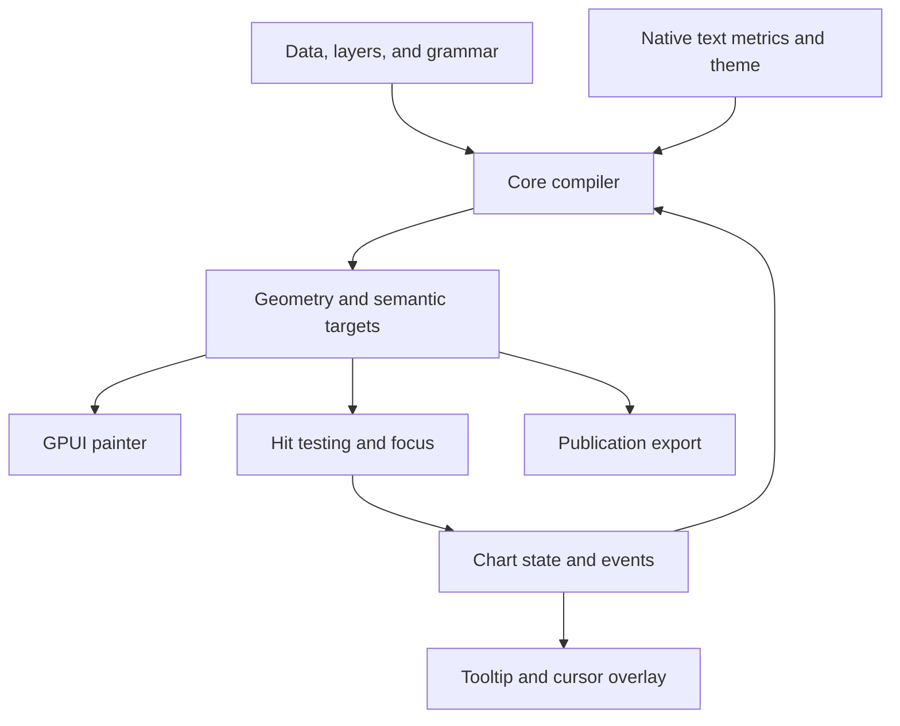

# Rust-native GPUI chart library: architecture and implementation plan

Project document version: 0.1.0. Revised 6 September 2026. This document records the independent grammar-of-graphics architecture informed by ggplot2, TanStack Charts, D3, and Apache ECharts, including custom publication design, streaming, full interaction and future bindings. It is architecture rationale and reference research; no chart library has been implemented or benchmarked as part of this planning exercise. API examples and crate names below are proposals.

This file is one part of the project handoff. Read the [project specification](gpui-charts-specification.md) for normative requirements, precise semantic defaults, scope and release gates; read the [implementation plan](../impl_plans/gpui-charts-implementation-plan.md) for ordered work packages, dependencies, ownership, evidence and the AI-developer kickoff prompt. Explicit project-owner instructions take precedence, followed by the specification. This migration document provides rationale rather than a competing implementation backlog. Its dependency snapshots are dated research; implementation must verify and pin the host-compatible versions.

## Recommendation

Build an independent Rust grammar of graphics with a GPUI renderer and optional GPUI Kit integration. Select each subsystem's design on its merits: ggplot2 for the layered statistical grammar; TanStack for typed, composable application-facing authoring and scene separation; D3 for modular numerical and geometry algorithms; ECharts for datasets, actions, and interactive application components. Establish one coherent native contract, with existing GPUI Kit code informing drawing and integration.

The product should offer both convenient components such as `LineChart` and a composable `Chart` API. Both must compile through one engine. Prioritize general Cartesian and statistical composition, synchronized panels, and interaction with tables. A finance workbench is one useful integration example, with time series, heatmaps, and candlesticks; it does not determine the generic library's data model.

Four cross-cutting requirements shape the foundation: complete theme control and desktop-publishing-quality figures; continuous updates with stable interaction state; a comprehensive extensible action/interaction model; and a portable Rust core suitable for future Python and WASM adapters. Theme/export, data-update, and portable specification contracts must be implemented early. Production Python packages and a browser host remain future deliverables, with small feasibility prototypes required before the core API stabilizes.

Our documented grammar and behavior are authoritative. Reference libraries provide design examples and selected test oracles; reproducing any one's full API or feature set is not a release objective. Production chart compilation, statistics, layout, interaction, and geometry execute in Rust. R and JavaScript are optional development-only reference tools. Arbitrary R expressions, JavaScript functions, DOM elements, and CSS are outside the native API.

## 1. Evidence and reference implementations

The `/latest` TanStack documentation follows unreleased alpha `main`; it identifies `0.16.0` as the latest published release. Pin any reference fixtures to a commit. A URL named “latest” is unsuitable as a permanent test oracle. [TanStack overview](https://tanstack.com/charts/latest/docs/overview)

TanStack's current model is a chart grammar, with mark-local data and channels compiled into a keyed scene. Its public scene node families are group, rule, polyline, area, dot, rectangle, and label. Interaction metadata is associated with the geometry while retaining original data identity. [Grammar](https://tanstack.com/charts/latest/docs/concepts/grammar-of-graphics), [custom marks and renderers](https://tanstack.com/charts/latest/docs/guides/custom-marks-and-renderers)

The upstream native-platform investigation also identifies the scene/compiler separation as the useful boundary, while assigning sizing, text, rendering, gestures, and accessibility to native hosts. That document is a dated design investigation; current source takes precedence over its descriptions of implementation status. [Native platform investigation](https://github.com/TanStack/charts/blob/main/NATIVE-PLATFORM-SUPPORT-SPIKE.md)

GPUI Kit already documents line, bar, area, pie, radar, candlestick, and Sankey components. Its lower-level `plot` module supplies scales and shapes. These are useful reuse candidates, but chart-type availability alone does not establish equivalent composition, scale, or interaction semantics. [GPUI Kit charts](https://gpui-kit.com/docs/components/chart/), [plot primitives](https://gpui-kit.com/docs/components/plot/)

Selected source snapshots inspected:

| Repository | Snapshot | Relevant findings |
| --- | --- | --- |
| TanStack/charts | `258ed39382b09843f98e6f48a2e9d4d0bd3f1d41` | Inspected `packages/charts-core/src/types.ts`, `scene.ts`, and `runtime.ts`; the scene includes callable scale/focus behavior as well as geometry. |
| longbridge/gpui-kit | `cbdf5baa26a5c20ae5c1d7481bffdd1d0d2abd3d` | Inspected workspace dependencies, the scale trait, linear scale, and line chart; the workspace selects `gpui-pre` 0.3.1 under the name `gpui`. |

The GPUI Kit scale trait exposes mapping to `Option<f32>` and nearest-index helpers. The inspected line chart uses a categorical/string-convertible x channel. I would therefore own the new numerical and temporal scale contracts rather than make them depend on the existing widget API. [Scale trait](https://github.com/longbridge/gpui-kit/blob/cbdf5baa26a5c20ae5c1d7481bffdd1d0d2abd3d/crates/component/src/plot/scale.rs), [line chart](https://github.com/longbridge/gpui-kit/blob/cbdf5baa26a5c20ae5c1d7481bffdd1d0d2abd3d/crates/component/src/chart/line_chart.rs), [workspace dependencies](https://github.com/longbridge/gpui-kit/blob/cbdf5baa26a5c20ae5c1d7481bffdd1d0d2abd3d/Cargo.toml)

## 2. Define the independent design contract

| Dimension | Contract |
| --- | --- |
| Semantic correctness | Publish our own contracts for statistics, grouping, scales, positioning, coordinates, identity, and actions; compare reference outputs where those contracts agree. |
| Visual correctness | Publication-quality typography/layout, complete custom themes, and verified vector SVG/PDF plus raster output; explicit screen and publication profiles. |
| Authoring | One coherent grammar expressed through Rust builders and typed closures, with concise chart recipes. |
| Specification interchange | Versioned portable specification, data-update and action contracts designed from the start; initial bindings may cover a subset. Unknown constructs produce actionable errors. |
| Streaming | Batched append/correction/removal/replacement with explicit ordering, retention, overload and state-preservation policies. |
| Interactivity | Pointer/keyboard navigation, zoom/pan, brushing/lasso, linked views, editable annotations and typed programmatic actions for supported chart families. |
| Runtime | Rust/GPUI operation; no R runtime, JavaScript interpreter, webview, or foreign chart engine required. |
| Integration | Standalone GPUI adapter, plus optional GPUI Kit styling and controls. |
| Outside desktop scope | DOM reconciliation, React lifecycle, CSS cascade, browser SSR/hydration, and source compatibility with reference libraries. |

Use an independent project name, provisionally `gpui-charts`. Preserve applicable notices when adapting source or fixtures and record provenance for imported algorithms. Architectural inspiration does not require source translation; source reuse needs a separate license/provenance check for the specific component. Check package-name availability before publishing.

### Component-by-component design choices

| Subsystem | Main inspiration | Proposed native design and reason |
| --- | --- | --- |
| Layer grammar | ggplot2 + TanStack | `Layer = data + mapping + stat + geom + position`, with chart defaults and explicit layer overrides; supports statistical plots and unrelated annotation datasets. |
| Aesthetic mapping | ggplot2 + TanStack | Typed x/y/color/size/shape/group/key channels, separate from constant styles. Generated statistical outputs have their own typed mappings. |
| Statistics | ggplot2 | Reusable `Stat<Input, Output>` stages, independent of drawing; binning, summaries, quantiles, density, and simple fitting can feed multiple geoms. |
| Position adjustments | ggplot2 | Stack, normalize, dodge, and seeded jitter are explicit operations, with specified data or display space. |
| Scales and geometry algorithms | D3 | Small independent modules for numeric/calendar scales, tick generation, interpolation, paths, spatial lookup, and optional advanced layouts. |
| Facets and guides | ggplot2 | Repeated panels, explicit shared/free scales, semantic legend generation, and centralized theme rules. |
| Definition and scene boundary | TanStack + native requirements | Lightweight authoring compiles into geometry, target identity, and resources consumed by the GPUI adapter. |
| Shared data and transformations | ECharts | Named/versioned datasets and reusable derived outputs; different views can consume the same preparation without duplicating it. |
| Interactive component behavior | ECharts + TanStack | Typed actions/events for focus, viewport, selection, visibility, brush, and linked views, independent of native input mechanics. |
| Native runtime | Rust + GPUI | Explicit ownership, immutable snapshots, revision-aware caches, bounded worker jobs, and native rendering. |

These are design recommendations, not claims that one library is universally superior. ggplot2 explicitly separates layers' data, statistics, geoms, and positioning. D3 distinguishes its independent data-only modules from DOM-oriented modules. ECharts documents reusable datasets and explicit actions. [ggplot2 layers](https://ggplot2.tidyverse.org/reference/layer.html), [D3 architecture](https://d3js.org/what-is-d3), [ECharts datasets](https://echarts.apache.org/handbook/en/concepts/dataset/), [ECharts actions](https://echarts.apache.org/handbook/en/concepts/event/)

Keep a short design decision record for each subsystem: required behavior, considered references, selected semantics, Rust interface, dependency/provenance, alternatives, and acceptance cases. Evaluate numerical correctness, composability, clarity, performance, extensibility, and maintenance cost. Favor an existing Rust implementation when its semantics and quality fit; adapting an algorithm into Rust remains an option.

### Grammar concepts

| Concept | Meaning |
| --- | --- |
| `Dataset` | Versioned rows or columns, including stable identities, validity, and optional units/labels. |
| `Aes` / channels | Mappings from source or computed values to visual encodings. |
| `Stat` | A declared computation such as binning, quantiles, or regression, with typed outputs and provenance. |
| `Geom` | The representation of prepared values: points, lines, rectangles, ribbons, text, and custom geometry. |
| `Position` | An explicit adjustment such as stacking, dodging, or jitter. |
| `Scale` | Domain and mapping for position, color, size, opacity, or shape. |
| `Coord` | Coordinate projection, clipping, aspect ratio, and viewport semantics; Cartesian initially, polar later. |
| `Facet` | Partition into repeated panels, including data/group scope and scale-sharing policy. |
| `Guide` / `Theme` | Explanation of encodings and centralized appearance rules. |
| `Interaction` | State and actions controlling inspection, selection, viewport, and connected views. |

Simple constructors should hide explicit identity statistics and identity positioning. A histogram is a binning stat plus interval bars; a boxplot is summary statistics plus boxes/whiskers/optional outlier points; a candlestick is OHLC input plus a composite geom. These recipes share lower-level mechanisms instead of becoming independent engines.

Chart-level mappings may be inherited by compatible layers. A layer that supplies a different row schema must override incompatible mappings explicitly. Mapping a sector to color affects a color scale and guide; setting a stroke color supplies a constant style. Resolve that distinction in the API rather than guessing from string contents.

Generate legends from explicit scale bindings and compatible aesthetics. Merge guides only when their domain, mapping, labels, and semantic identity agree. Facet panels receive stable keys and declared group/statistic scope. A layer missing a facet variable must explicitly broadcast or target panels. [ggplot2 faceting](https://ggplot2.tidyverse.org/reference/facet_grid.html)

If the broader application remains Tauri/React, native GPUI surfaces require a GPUI host. A future browser adapter can render the portable Rust core's output and could integrate with the existing web frontend. Web rendering is a separate host; WASM support for the core must not depend on whether the chosen GPUI release can itself target the browser.

## 3. Workspace structure

Start with four library crates and one development application. Keep internal modules private until real consumers justify additional public boundaries. Reserve separate adapter crates for future language bindings.

| Proposed crate | Responsibility | Dependency rule |
| --- | --- | --- |
| `chart-core` | Portable spec/data/action types; normalization, stats, positioning, scales, coordinates, facets, geoms, guides, scenes, state, hit testing | No GPUI/Python/JS types; no mandatory OS fonts, file/network I/O or native threading. |
| `chart-export` | Publication layout support and SVG/PDF/PNG exporters | Depends on portable core and verified Rust export/text dependencies; headless use has no GPUI dependency. |
| `gpui-charts` | Persistent chart state, native text measurement, GPUI painting, input translation, focus and accessibility integration | Depends on core and one selected GPUI release line. |
| `gpui-charts-kit` | Theme adapter, chart cards, legends, tooltips, menus, toolbar, table-link examples | Depends on GPUI adapter and compatible GPUI Kit. |
| `chart-gallery` | Executable examples, fixture comparison, stress workloads, interaction scenarios | Development-only application. |
| `chart-python` — future | PyO3 adapter for specs, column batches, actions, scenes and headless export | Depends on core/export; native viewer and interactive notebooks are separate integrations. |
| `chart-wasm` — future | wasm-bindgen adapter and browser-facing data/action interface | Depends on portable core; browser rendering/events supplied by a separate host. |

Use feature-gated modules for advanced statistics, temporal extras, polar geometry, and export formats. Define the portable schema from the start; serialization support may remain feature-gated. A columnar adapter can integrate Arrow/Polars data later without making either a mandatory core dependency. Finance recipes belong in an optional module or downstream package; the generic library should not depend on pricing or portfolio analytics.

Define host service boundaries for text/font resolution, task scheduling, clocks, resource loading, and frame presentation. The core supports synchronous/cooperative execution as its baseline; native workers and browser workers are adapter choices. Require `Send`/`Sync` where a native task crosses threads instead of exposing GPUI or interpreter objects through the portable model. Export functions accept bytes/resources and return bytes; file dialogs and filesystem writes belong to the host.

Select the target GPUI dependency with the host application. If using the inspected GPUI Kit line, match its `gpui-pre` package/source exactly. Avoid mixing standard `gpui`, `gpui-pre`, and another fork within one public type surface. A renderer for another GPUI line should be a separate tested adapter, not assumed compatible because method names look similar.

## 4. The compilation and presentation model



The compiler should have explicit stages:

1. Validate bindings, inherit compatible defaults, and resolve versioned dataset/transform dependencies.
2. Apply explicit source filters and bind source channels; establish facet panels, groups, and statistic scope.
3. Prepare each stat's declared calculation space, run the stat, and bind its generated channels. Identity stats retain original rows.
4. Apply semantic position adjustments and gather domain contributions, including statistical intervals and stack endpoints.
5. Train scales and guides, apply declared domain/viewport policies, and solve panel layout and native text margins. Cap layout iterations with a deterministic fallback.
6. Resolve scale mappings and any display-space positioning; construct/project geometry through the selected coordinate system into final plot bounds.
7. Resolve final paint styles, compile resources and semantic targets, and update the required spatial indexes. Size/shape mappings that affect geometry are resolved before geometry construction.
8. Present through GPUI; input actions update state and invalidate only affected dependencies.

This is a dependency plan, not an assumption that every chart can be built in a single pass. Computed stat outputs can create domains; facets can share them; native text depends on the resulting ticks. Compile these dependencies explicitly and restrict stages that can feed back into layout.

### Calculation order and semantic decisions

ggplot2 distinguishes source mappings, mappings of computed statistical values, and mappings after scale resolution. Use the same explicit stage distinction through typed Rust outputs; a bin-count accessor should accept a `BinnedRow`, not accidentally access the original observation. [ggplot2 evaluation stages](https://ggplot2.tidyverse.org/reference/aes_eval.html)

The proposed default is to calculate statistics in source data units. A stat that needs transformed input must declare it, for example `StatSpace::Transformed(Log10)`. Transform descriptors and output metadata distinguish original values, transformed values, and their inverse mapping where valid, so the renderer cannot apply a transform twice. Screen-space binning is a separate, explicitly viewport-dependent operation. This intentionally differs from ggplot2's normal scale-transform-before-stat order; use matching policies when comparing fixtures. [ggplot2 build order](https://ggplot2-book.org/internals.html)

| Operation | Proposed behavior |
| --- | --- |
| Source filter | Changes the data population and recomputes dependent statistics. |
| Scale mapping/domain | Controls encoding and axis range; explicit out-of-bounds policy controls omission/clipping, without implicitly changing upstream statistics. |
| Viewport zoom | Changes the visible region while preserving full-population statistics by default. |
| Visible-range statistic | Explicit opt-in; recomputes when the viewport changes and is keyed accordingly. |
| Stack/normalize | Operates in declared data units; normalized totals and mixed-sign behavior are specified. Reject incompatible nonlinear additive encodings unless an explicit alternative is selected. |
| Jitter/dodge | Declares data, band-relative, or display units; jitter uses a stable seed and row key. |

For example, scrolling into the last month must not silently refit a regression intended for the full year. ggplot2's coordinate-zoom distinction is a useful reference for keeping view changes separate from changes to the analyzed data. [Coordinate zoom](https://ggplot2.tidyverse.org/reference/coord_cartesian.html)

Separate an alternate-unit secondary axis, which transforms an existing scale, from an independent named scale attached to a layer. The native library may support both. ggplot2's secondary-axis contract is a one-to-one transformation; it should not accidentally constrain independent scales needed by the workbench. Prefer aligned panes where independent units make an overlaid chart hard to interpret. [ggplot2 secondary axes](https://ggplot2.tidyverse.org/reference/sec_axis.html)

A scene should contain geometric primitives, paints, clip/transform scopes, label specifications, and stable target references. Add path command buffers for curves and arcs. Prefer numerical command buffers over constructing and reparsing SVG path strings during native rendering.

Keep stable keys for chart, view, mark, series, and datum. Use persistent row IDs rather than array positions for data that can reorder or roll. Decorative grids and annotation backgrounds should not create artificial selectable rows.

### Typed authoring and heterogeneous data

Use typed layer/geom builders over `Dataset<T>` handles backed by immutable snapshots, with `Arc<[T]>` as a straightforward first implementation. Accessors and `Stat<Input, Output>` preserve types during preparation; erase layer types at the compiler boundary after validation and channel extraction. Different layers must be able to consume different row types and lengths. Use closed enums for common scene primitives and narrow extension traits for statistics, geometry, scales, and coordinates; avoid propagating every type parameter through the renderer.

The compiled scene should store stable target references and normalized semantic values, not a heap-allocated copy of every original row. A `TargetRef` distinguishes a source row, an aggregate/bin, and a derived value. An aggregate carries a stable group/bin identity plus a dataset revision and membership resolver or compact source spans. A fitted curve records its input scope and model/stat identity. Typed callbacks or resolvers recover original rows when meaningful. An aggregate must not masquerade as one source row in a tooltip or table selection. Define behavior when a pinned target disappears.

Support `Option`/validity information explicitly. Missing data must not silently become zero. Default line behavior should split paths at missing values; expose an explicit policy for connecting gaps. Reject non-finite values before passing coordinates to the painter.

Use `f64` for data-space arithmetic and scale calculations. Store timestamps as integer instants; subtract an appropriate origin before floating-point conversion. Convert to GPUI pixel types only after projection into local plot coordinates. Preserve original exact amounts or decimals for labels when supplied by the application.

An illustrative API, to be validated during the prototype:

```rust
// Proposed API only. The layers share compatible source mappings.
let definition = Plot::new(observations.clone())
    .aes(
        Aes::new()
            .x(|r: &Observation| r.duration)
            .y(|r| r.spread_bps)
            .color(|r| r.sector.clone()),
    )
    .layer(geom::point())
    .layer(
        stat::linear_fit()
            .space(StatSpace::Data)
            .geom(geom::line()),
    )
    .facet(Facet::wrap(|r: &Observation| r.rating.clone()))
    .scale_y(LinearScale::new().include_zero(false))
    .theme(ChartTheme::from_tokens(theme_tokens))
    .interaction(Interaction::brush_xy());

// A retained Entity<ChartState> owns data versions, viewport, focus, and caches.
// A render call constructs a lightweight element using that existing state.
Chart::new(chart_state.clone()).height(px(320.0))
```

Here the statistical line is fitted per declared facet/group, with generated x/y channels bound to the line geom. Chart recipes should document such grouping defaults and permit overrides. Also provide concise `LineChart`, `BarChart`, `AreaChart`, `ScatterChart`, and `CandlestickChart` constructors. Each expands to ordinary layers and shared scales; custom composition remains available without changing the data model.

Implement a versioned serializable specification for field mappings, known stats, scales, coordinates, and themes alongside the typed builder. Both lower to the same validated representation. Arbitrary closures remain native-only; portable bindings use declarative expressions or registered identifiers. Host event handlers and GPUI elements stay outside the portable definition. Exercise a small specification/data/action round trip through Python and WASM prototypes before stabilizing the API. See sections 14–17 for the theme, streaming, interaction, and binding contracts.

## 5. Public extension and ownership boundaries

| Boundary | Native responsibility | Implementation choice |
| --- | --- | --- |
| `Dataset` / transform graph | Source ownership, shared derived data, validity and revisions | Typed rows initially; optional columnar adapters; atomic append/upsert/remove/replace deltas and explicit retention. |
| `Stat` | Input requirements, computation scope, output schema, provenance | Pure Rust computation; cache by data, parameters, grouping and declared viewport dependence. |
| `Geom` | Turn prepared encodings into keyed primitives and target references | Geoms share scales/coords and never own separate chart lifecycles. |
| `Position` | Data/band/display placement adjustments | Explicit ordering and coordinate-space contract. |
| `Scale` / `Coord` | Mapping, domain, ticks, inversion or projection | Narrow capabilities; nonlinear coordinates may need adaptive path subdivision. |
| `Facet` / `Guide` | Panel partitioning, scale sharing and explanation | Stable panel IDs, shared datasets, compatible legend merging. |
| Compiler/runtime | Validated plan, preparation, layout and invalidation | Our semantics are authoritative; selected reference algorithms are tested independently. |
| Scene | Geometry, text, resources, target ownership | Numerical path buffers, clipping/transform scopes, separate interaction metadata. |
| Publication export | Coherent figure snapshot, physical dimensions, fonts and output resources | Headless vector/raster adapters; explicit fidelity and fallback diagnostics. |
| Portable bindings | Versioned specs, batch data updates and actions | Validated portable types; language handles and callbacks stay in their respective hosts. |
| GPUI adapter | Native lifecycle, text, painting, input, focus | Match one host dependency line; keep platform types out of core. |
| Recipes / finance adapter | Reusable layer compositions and external analytics | Finance calculations stay in application/finstack; chart rendering consumes the results. |

The inspected TanStack [core types](https://github.com/TanStack/charts/blob/258ed39382b09843f98e6f48a2e9d4d0bd3f1d41/packages/charts-core/src/types.ts), [scene compiler](https://github.com/TanStack/charts/blob/258ed39382b09843f98e6f48a2e9d4d0bd3f1d41/packages/charts-core/src/scene.ts), and [runtime](https://github.com/TanStack/charts/blob/258ed39382b09843f98e6f48a2e9d4d0bd3f1d41/packages/charts-core/src/runtime.ts) remain useful implementation references. The new layers/statistics/coordinate model is designed independently.

## 6. Scales and layout are the first major engineering workstream

Define separate mapping capabilities for continuous and categorical scales. Continuous scales may support `invert`; bands need category lookup and band extents. Do not force an inaccurate common inverse API onto every scale.

The first scale set should include linear, band, point, ordinal color, UTC time, logarithmic, and symmetric logarithmic. The initial vertical slice can start with linear, band, and UTC. Explicit scale IDs should support multiple y axes and later shared or independent scales across panes/facets.

Specify domain precedence: explicit user domain, transformed data-derived domain, zero/baseline inclusion, padding/nice policy, and visible viewport. Hidden-series handling must be a declared policy. A zoomed viewport should survive unrelated data updates.

Test descending domains/ranges, constant and empty domains, negative bars, mixed-sign stacks, log-invalid values, category order, and tick formatting. UTC/calendar ticks need calendar interval logic rather than equal numerical steps. D3 distinguishes local and UTC calendar scales, which is a useful behavioral reference. [D3 time scales](https://d3js.org/d3-scale/time)

Treat trading-session time as a separate scale or mapping. Require an application-provided session calendar, define how gaps map and invert, and keep continuous elapsed-time charts available. Do not silently collapse weekends or holidays on a general-purpose time axis.

Text measurement should use the same native shaping/font choices as paint. Cache by content, font identity, size, weight, locale/direction, and scale factor where relevant. Recompute margins after changes to fonts, formatters, bounds, theme typography, and axis configuration. Tick thinning and margin containment are separate problems.

## 7. GPUI implementation

Use `canvas(...)` for the earliest drawing spike, then a custom chart `Element` where layout, hitboxes, focus, and child overlays require control. GPUI's documented lifecycle separates layout requests, prepaint, and paint. Validate exact signatures and available capabilities against the GPUI release selected by the application. [GPUI Element lifecycle](https://docs.rs/gpui/latest/gpui/trait.Element.html)

| Stage | Responsibility |
| --- | --- |
| Retained state | Data/configuration revisions, immutable prepared data, viewport, focus, selection, cached geometry, subscriptions. |
| `request_layout` | Participate in parent sizing; provide sensible minimum/intrinsic sizing without rebuilding data. |
| `prepaint` | Use resolved bounds, obtain text metrics, finalize plot geometry when dirty, place overlays, register hit regions. |
| `paint` | Submit cached geometry through native paths/quads/text, respect clips and paint order, present focus/selection overlays. |
| Input adapter | Translate window coordinates, pointer/scroll/key events and gesture lifecycle into core actions. |

Use one chart element or a bounded number of pane elements. Do not allocate one GPUI entity for every point. Batch geometry where compatible with paint ordering and interaction identity. Cached CPU paths do not automatically imply retained GPU resources; profile the selected GPUI backend's actual submission and tessellation costs.

The capability spike must exercise curved and dashed strokes, joins/caps, area fills, gradients, clipping, rotated labels, high-DPI text, overlays outside a plot, and native input behavior. Confirm polygon holes and nested clips before promising geography or complex polar parity. GPUI is not a browser Canvas 2D context; each needed primitive must have a tested path.

Native tooltip bodies should allow a caller-supplied GPUI element. Keep small overlays and controls as ordinary UI elements. Map chart colors and typography through an independent theme object, with a GPUI Kit adapter for the host's palette and spacing. Publication content such as titles, legends, labels, notes, and annotations must also have portable scene representations; an arbitrary native element is not automatically an exportable figure object.

Accessibility requires a chart summary, meaningful focus targets, keyboard traversal/activation, and an accessible data representation. Verify the chosen GPUI platform's actual accessibility support during the spike. Keyboard handling by itself is not screen-reader parity; any platform gaps remain explicit release limitations.

## 8. Interaction and performance

Follow ECharts' useful separation of explicit actions from resulting events, implemented as Rust enums and typed payloads. `ChartAction` includes viewport change, series visibility, target focus, selection, reset, and brush state. Pointer input, keyboard input, toolbar controls, and programmatic calls use the same action path. Emit changes after effective state transitions and attach origin/revision IDs for linked views. These semantics should be testable without a window. [ECharts event/action model](https://echarts.apache.org/handbook/en/concepts/event/)

Use separate operations to replace a plot specification, patch known configuration fields, and apply an atomic dataset delta: append, upsert, remove, or replace. Define state preservation explicitly; avoid importing implicit option-merge behavior into the Rust API. Shared dataset transforms should produce reusable, versioned outputs, including multiple outputs such as a box summary and outlier rows. ECharts' transform pipeline is a useful design reference. [Dataset transforms](https://echarts.apache.org/handbook/en/concepts/data-transform/)

Keep hover, keyboard focus, pinned tooltip, selection, brush, drag, viewport, and auto-follow state separate. Define gesture precedence so that brushing and panning cannot both claim the same drag. Reset/cancel state on escape, capture loss, or relevant data removal.

Support these first:

- Nearest-x/grouped tooltip for time series and exact geometry containment for bars/cells.
- Crosshair, keyboard traversal, activation, and legend visibility toggles.
- Wheel/trackpad zoom, drag pan, range brush, and reset controls.
- Shared cursor, domain, and selection channels for chart panes and linked tables.

Link views using semantic values and stable row IDs, not pixel coordinates. Each receiving chart projects into its own viewport. Add origin and revision information to prevent feedback loops; incompatible scales or missing timestamps need explicit matching policies.

A brush emits a selection. The application decides whether to highlight, drill into aggregates, or filter another dataset; a highlight must not silently change the population used by statistics. Share prepared data across facets and panes through indices/handles, with explicit per-panel scope where computation differs.

For sorted time series, use indexed/binary-search lookup around x plus local candidates. For scatter, evaluate a spatial grid or tree. All hit testing must respect the same transforms, clips, and z-order as painting. Rebuild indexes when relevant geometry changes; style-only hover should not rescan all data.

Use a dependency-aware cache:

| Change | Expected invalidation |
| --- | --- |
| Pointer movement | Hit query and overlay presentation only, unless an authored hover state changes geometry. |
| Palette change | Paint/style data; preserve numeric channels and domain calculations. |
| Font/format change | Text metrics, guides, margins, and dependent geometry. |
| Resize or viewport change | Scale ranges/viewport, layout, visible geometry, and screen-space indexes. |
| Data revision | Affected channel and transform caches, domain policy, dependent geometry/indexes. |

For streams, use chunked or ring-buffer storage, bounded visible ranges, and coalesced presentation updates. Preserve accepted data according to the explicit retention/overload contract in section 15. Large preparation runs on background workers with immutable inputs. Present results with compatible spec/layout/viewport stamps and monotonically advancing coherent store commit revisions, even when a newer data batch is pending. Reject incompatible or superseded results, but do not cancel every build on every incoming batch and starve presentation. Keep GPUI window and text APIs on their required thread. The specification's STM-04 defines the authoritative scheduling contract.

For dense lines, use a width-dependent envelope that retains ordering, gaps, boundary continuity, and extrema. Retain the raw data for exact inspection. Aggregate candles with first open, maximum high, minimum low, last close, and summed volume, within explicit time/session buckets. Dense scatter should offer aggregation or drill-down when separate dots stop being useful.

The upstream large-data guide separately accounts for source rows, represented data, prepared geometry, and rendered work; use the same accounting in native benchmarks. GPU painting alone does not remove compilation, memory, or hit-testing costs. [Large-data guidance](https://tanstack.com/charts/latest/docs/guides/large-data)

Proposed acceptance workloads, to calibrate during the spike rather than advertise as achieved:

| Workload | Proposed target |
| --- | --- |
| Ten series with 10,000 observations each at about 1,200 logical pixels width | Smooth 60 Hz interaction after preparation; report downsampling and output vertices. |
| One million stored time-series observations with a bounded visible representation | Avoid a full scan/rebuild on hover; retain exact source lookup and visible extrema. |
| 50,000 scatter observations | Measure raw indexed rendering, then establish the crossover to aggregation. |
| Dashboard with 12 updating charts | Coalesce updates, preserve unrelated chart caches, keep memory bounded over sustained use. |
| Common-chart hover and cursor movement | Aim for p95 chart work below 4 ms and total frame time below 16.7 ms on declared reference hardware. |

Measure cold compilation, updates, layout, tessellation/submission, presented frame time, pointer latency, memory, and disposal separately. Report hardware, OS, build mode, logical dimensions, and pixel scale. Treat 120 Hz as a later measured target, not an automatic consequence of GPUI.

## 9. Independent correctness and reference validation

Maintain our own canonical grammar fixtures. Use hand-verifiable examples, numerical properties, and invariants as the authority. Reference comparisons are scoped to an explicitly chosen shared behavior, with dependency versions and calculation policies recorded. A difference from a reference can be correct when our documented semantics differ.

**Renderer path:** directly construct canonical primitive scenes and verify GPUI output. Optionally execute pinned TanStack fixtures in a development-only JavaScript runner and extract normalized scene DTOs for additional coverage. Resolve functions, styles, resource references, and formatter output explicitly. Include geometry, keys, labels, paints, clip scopes, and semantic target IDs.

**Compiler and semantics path:** compile canonical fixtures through Rust and compare expected statistics, domains, keys, geometry, and action traces. Use ggplot2 for selected layer/stat/facet references, D3 for selected scale and geometry algorithms, and ECharts for selected action/dataset behaviors. Match all relevant parameters, bin edges, quantile definitions, grouping, and transformation space before treating external output as an oracle. Use deterministic text metrics for compiler tests and native screenshots for text integration.

A current `ChartScene` is renderer-independent but is not automatically a JSON wire format: its resolved scales and focus-related structures include functions. Never assume `JSON.stringify(scene)` produces a complete replayable chart. An extracted DTO is a deliberately narrower contract. [Inspected scene types](https://github.com/TanStack/charts/blob/258ed39382b09843f98e6f48a2e9d4d0bd3f1d41/packages/charts-core/src/types.ts)

A replayed scene is tied to its compiled dimensions and does not restore missing scale inversion, callbacks, statistics, or responsive layout. The production Rust compiler owns those behaviors. Keep any JavaScript and R runners in optional development tooling; retain generated reference fixtures so routine Rust tests can run without those runtimes.

Begin with fixtures for a gapped line, an uncertainty band, grouped/stacked bars including negatives, scatter, a heatmap, multiple y axes, candlesticks/volume, linked panes, and a custom mark. Add empty, singleton, degenerate-domain, reordered-row, hidden-series, and high-DPI cases.

Test semantics at each layer: numeric/property tests for stats/scales/transforms; geometry snapshots for layout; action/event traces for interaction; screenshot review for native rendering. Include conservation of bin/stack totals, stable seeded jitter, facet/group scope, aggregate provenance, zoom-versus-filter effects, raw-versus-transformed statistics, mapping/constant-style distinction, resize, interrupted drag, pinned-target removal, and stale worker completion. Run supported platforms before declaring production support.

## 10. Feature sequence

| Release tier | Features |
| --- | --- |
| Vertical slice | Native layer/stat/geom contracts; identity stat plus one bin/summary stat; linear/band/UTC scales; line/point/rule/rectangle geoms; axes, native text, hover; theme/spec/delta/action contracts, an export/font capability proof, and minimal Python/WASM core prototypes. |
| Cartesian alpha | Area/ribbon, grouped/stacked bars, scatter, cells/heatmaps, histogram, simple statistical overlays, initial facets, semantic guides, numeric color scales, custom extensions, three contrasting themes, multi-panel figure layout, and initial SVG/PDF/PNG output. |
| Interactive streaming beta | Multiple scales/panes, log/symlog, zoom/pan/brush/lasso, linked cursor/table selection, editable annotations, full supported-chart action paths, append/correction/removal streams, stable navigation and bounded queues. Finance recipes can exercise candlestick/volume and explicit session-time support. |
| Production release for selected scope | Publication and sustained-streaming gates, keyboard/accessibility verification, interaction cancellation/ownership checks, portable-core binding proofs, robust resize/disposal, documentation, platform CI and fidelity/error diagnostics. |
| Optional expansion | Advanced facet/guide variants, polar/pie/radar, box/violin distributions, hierarchy, Sankey, geography/projections, contours/vector fields, and richer motion as separately estimated modules. |
| Future distribution/integration | Production Python wheels and ergonomic APIs, native Python viewer, browser host and WASM package, and interactive notebook widgets; estimate and release these separately from the early portability proofs. |

Introduce the facet/shared-scale and stat/geom abstractions before expanding specialized chart families. Initial chart statistics should stay small and auditable: identity, count/bin, summaries/quantiles, and a simple linear fit. The specification fixes their defaults, including bin edges, quantile interpolation, mixed-sign normalization and source-data statistical space. Density and more sophisticated fitting can follow as optional modules. Advanced financial analytics, factor attribution, and valuation results should be computed in the application or existing finance library and passed as rows. Preserve provenance and parameter metadata for computed overlays.

Animation should begin with optional opacity and compatible-geometry transitions. Preserve keys, handle interruption, obey reduced-motion settings, and keep hit targets aligned with the presented frame. Complex cross-chart morphing can wait. For streaming finance charts, immediate updates may be the correct default.

Treat SVG, PDF, and PNG output as release requirements for the supported publication scene. Implement them through `chart-export`, with font handling, physical dimensions, clipping, gradients, and fidelity tests. Native tooltips and controls are excluded from figure exports by default; an application can supply portable equivalents when needed. Publication export must snapshot a consistent data/spec/state revision while streaming continues.

## 11. Delivery plan and effort

The authoritative execution backlog is the companion implementation plan: WP-01 through WP-23, grouped into M0 through M4 with gates G0 through G4. The table below is a high-level planning summary; detailed package prerequisites and acceptance criteria live in that plan.

These are provisional planning estimates for one experienced developer working full time with AI coding assistance. They include integration, review, tests, and documentation for the stated scope, but do not assume that native accessibility or renderer capability gaps are already solved. Re-estimate after the renderer, font/export and binding spikes. Part-time work and changes to the target GPUI line extend elapsed time.

| Phase | Effort | Deliverable and exit criterion |
| --- | --- | --- |
| 0. Design contracts and rendering/export proofs | 2–3 weeks | Decide calculation order, interfaces, portable schema and dependency pins; representative native paint/text/input fixtures and SVG/PDF font/geometry capability report. |
| 1. End-to-end portable core | 3–4 weeks | Typed layers, identity and bin/summary stats, basic scales, scene, native component and hover; atomic data-delta/state contracts; minimal Python/WASM compile, update and action proofs. |
| 2. Cartesian and publication alpha | 4–6 weeks | Common geoms, initial facets, shared guides/layout, full theme cascade, figure furniture and SVG/PDF/PNG output; statistical/custom extensions and semantic/visual fixtures pass. |
| 3. Interactive streaming beta | 3–5 weeks | Multi-axis/pane composition, navigation, brush/lasso, linked views and editable annotations; streaming corrections and retention; validate stable state, gesture ownership, cancellation and stale-work rejection. |
| 4. Production hardening | 4–6 weeks | Meet publication, sustained-streaming and interaction gates on declared platforms; verify binding ownership/portability, accessibility scope, docs, diagnostics and lifecycle behavior; cut a versioned release. |

With these expanded requirements, budget approximately 9–13 weeks for the Cartesian/publication alpha, 12–18 weeks for the interactive streaming beta, and 16–24 weeks for a production release of the selected scope. These are cumulative estimates, not commitments or additional durations. The budget includes minimal binding prototypes, not full Python/browser/notebook products. Publication quality, font handling, streaming correctness and comprehensive interaction account for the increase. Advanced chart families, press-specific color/PDF standards and mature language distributions receive separate estimates. Design inspiration itself adds no required runtime dependency.

The critical dependencies are: calculation-space and stat/group contracts before derived domains; scale semantics before guides; host and publication font metrics before reliable layout; stable source/aggregate identity and revision semantics before streaming interaction; portable schema and host-service separation before binding stabilization; baseline measurements before renderer optimization. Do not count chart types as independent tasks when they share these foundations.

## 12. First implementation tickets

These summarize the early engineering themes. Use the companion implementation plan's work-package IDs, readiness checks and status ledger to assign and track actual work.

1. Record the grammar/feature contract, per-component references, four cross-cutting requirements, GPUI/Kit dependency identity and host/export support matrix.
2. Create the core/export/GPUI/Kit workspace and a gallery with deterministic data; keep OS and interpreter services outside core.
3. Define layer/stat/geom/position contracts, calculation stages, provenance, scene types, stable IDs, portable spec/action types and atomic data-delta revisions.
4. Create hand-verifiable canonical fixtures; add selected reference fixtures and an explicit scene DTO extractor where useful.
5. Paint and export a scene containing a clipped curved line, rectangle, dot, rotated label and gradient; prove font handling, physical sizing and vector fidelity through SVG/PDF.
6. Implement linear/band/UTC mapping with degenerate-domain and round-trip checks, then point/line/rule geoms plus identity/bin stats.
7. Define the theme cascade and text-measurement interface; add bounded guide/margin solving and a multi-panel publication figure.
8. Add retained state, exact hit targets, keyboard focus, tooltips and a shared action reducer; define gesture capture/cancel and preview/commit behavior.
9. Apply append/upsert/remove batches during pan/selection; prove stable row identity, stale-work rejection, retention and explicit overload accounting.
10. Construct and update the same small portable fixture through Python and WASM prototypes; verify semantic equivalence, resource ownership and headless operation.
11. Prove shared-scale facets and linked views, export one coherent snapshot during ingestion, and benchmark update/hover/resize before expanding features.

At the end of the design/rendering spike, the project should have a coherent statistical grammar, evidence that GPUI can present the required primitives, a publication font/export proof, a demonstrated state/input path, an identified text/accessibility scope, and a measured starting cost. The next core milestone must validate the portable specification and binding boundary. If a renderer gap blocks a required feature, resolve its implementation or select a compatible rendering path; any proposed reduction in these user requirements is an explicit product decision.

## 13. Main risks and planned responses

| Risk | Planned response |
| --- | --- |
| References change during development | Keep our own contract authoritative; pin reference fixtures and review borrowed algorithms intentionally. |
| Conflicting semantics across reference libraries | Resolve calculation order, scope, and units in design records and executable canonical cases. |
| Incompatible GPUI package identities | Match the application's exact dependency source and release line; isolate adapter crates. |
| Underestimating D3-derived mathematics | Port a declared subset and validate algorithm-specific edge cases. |
| Native text differs from browser layout | Shared measurement interface, deterministic compiler tests, native layout QA. |
| Native and exported figures disagree | Publication profile with stable fonts, matching preview layout, physical sizing and SVG/PDF/PNG fidelity fixtures. |
| Export silently rasterizes or substitutes fonts | Explicit renderer capabilities, embedded/outlined font policy and diagnosed localized fallbacks. |
| Scene has unexpected executable state | Extract an explicit DTO; independently port runtime behaviors. |
| Large data stalls despite GPU rendering | Bound representation, cache stages, index interactions, measure the whole frame. |
| Ingestion exceeds preparation/presentation capacity | Bounded queues, batched deltas, declared backpressure/retention policy and exact accepted-data accounting. |
| Selection loses identity after statistics/updates | Stable row/aggregate/derived IDs, provenance resolvers, revision-aware updates and removal policy. |
| Gestures or linked charts fight continuous updates | Separate viewport/follow modes, presented-scene gesture references, typed preview/commit actions and origin/revision tracking. |
| Core accidentally depends on desktop or interpreter services | Continuous portable-target builds, host-service interfaces and early Python/WASM fixture prototypes. |
| Binding copies or lifetimes undermine correctness/performance | Batch column interfaces, explicit ownership, handle disposal and measured copy budgets; no assumed zero-copy behavior. |
| Arbitrary render features exceed GPUI support | Early capability spike and a published renderer matrix. |
| Accessibility varies by platform | Test platform support early and publish actual scope. |
| Scope expands to the union of four libraries | Ship the common grammar and finance workflows first; estimate specialized families separately. |

The first product goal is a composable, fast Rust grammar of graphics with custom publication design, robust live data and comprehensive interaction, integrated naturally with GPUI. Each additional capability must fit the same layer, computation, scale, coordinate, and interaction contracts.

## 14. Custom themes and desktop publishing quality

Custom themes and publication output are first-class requirements. Themes must control typography, spacing, grid/axis styling, colors, strokes, fills, symbols, labels, legends, annotation appearance, focus/selection states, and figure furniture. Support reusable named themes, versioned serialization, theme composition, and per-plot/per-layer overrides. GPUI Kit is one source of default tokens; themes must also work headlessly and through future bindings.

Define precedence explicitly: library defaults, host theme, selected named theme, plot overrides, layer overrides, then applicable interaction-state styling. An output profile selects which interaction states are exported and adjusts output-specific dimensions/typography through a separate declared override. Color-only changes preserve numerical preparation; typography and spacing changes invalidate relevant layout.

Use two output profiles backed by the same semantic model:

| Profile | Layout and presentation |
| --- | --- |
| Desktop | Responsive logical pixels, native controls/text, interactive overlays, bounded low-latency geometry. |
| Publication | Explicit physical width/height and point sizes, deterministic resources/layout, portable figure annotations, vector geometry, and declared approximation policy. |

Publication layout must support titles, subtitles, axis titles, aligned panels and panel letters, inset plots, legends, direct labels, callouts, source notes, and footnotes. Allow rich text runs and rotated labels; prioritize reliable typographic baselines, Unicode minus signs, tabular numerals, line spacing, numeric formatting, and collision avoidance. A full mathematical typesetting language can remain an extension, with supported notation represented through the same portable text/path model.

Measure labels using the fonts and shaping policy used for the destination. Provide explicit font resources/fallbacks and preserve their identity in reproducible export settings. Screen output can use native shaping. Publication export uses a tested font/shaping path shared with a publication preview or reconciled through exported glyph positions. Do not assume OS/browser/export font metrics match. Store logical text alongside any shaped geometry for search, accessibility, and editable export where supported.

Required output formats:

- SVG with vector marks and explicit dimensions, clips, gradients, labels, and resource IDs.
- PDF with vector marks and a tested font embedding/subsetting policy, subject to the supplied fonts' embedding permissions.
- PNG with explicit pixel dimensions or physical size and DPI; include 300/600 DPI publication cases.

Offer text-preserving and outline-text export modes where supported. Outlines provide appearance stability but sacrifice ordinary text editing/search, so expose the choice. Avoid flattening the entire figure to a bitmap. Unsupported effects must produce a diagnostic or an explicit localized raster fallback. Tagged-PDF accessibility and press-specific PDF/X, CMYK, spot-color, or ICC workflows are separate capabilities to specify and validate; ordinary vector PDF is not evidence they are supported.

Evaluate existing Rust components such as `resvg` for static raster rendering and `svg2pdf` for a vector conversion route. These are candidates, not selected dependencies or proven feature coverage. Test the chart feature/font matrix before adoption. [resvg](https://github.com/linebender/resvg), [svg2pdf](https://github.com/typst/svg2pdf)

Export from an immutable `FigureSnapshot`: specification, data revisions, declared viewport/selection, theme, fonts, annotations, output size, and geometry-quality policy. Exporting a live chart must not mix rows or axes from different revisions. Offer visible-view and full-domain exports explicitly. At publication size, rebuild geometry with the requested tolerance; a screen envelope must not silently determine the publication figure's resolution.

Portable custom geoms, labels, and annotations must emit supported scene primitives. A custom GPUI painter or widget is a native extension with a declared export representation or unsupported-export diagnostic. Publish a feature matrix for GPUI, SVG, PDF, PNG, and the eventual browser renderer.

## 15. Streaming data and incremental updates

Define data mutation independently from specification changes. `DataDelta` supports `AppendBatch`, `UpsertByKey`, `RemoveKeys`, `ReplaceSnapshot`, and explicit retention/window changes. Include dataset identity, schema version, a monotonic revision/sequence, and enough validation to detect stale or incompatible operations. Stable row keys distinguish a corrected candle from a newly appended candle.

Batch application is atomic from the chart's perspective. A transaction may update several linked datasets so a price/volume view presents consistent revisions. Streaming does not require storing market connections inside the chart package: application feeds, replay engines, Python code, or browser transports deliver batches through the same API.

Separate these rates: source arrival, accepted data updates, statistical/geometry preparation, and screen presentation. The renderer may coalesce frames while the data layer retains every accepted update under its declared policy. Configure queue bounds and backpressure; return status for rejection, dropping, or summarization. Never describe a latest-value/drop policy as lossless ingestion.

Specify policies for duplicate sequence numbers, out-of-order timestamps, late corrections, missing intervals, retention eviction, and schema changes. Append-only sorted data can take a fast path. Corrections invalidate affected windows, domains, aggregates, and spatial indexes. Stable IDs survive sorting and retention; disappearing selected/pinned targets follow a declared removal policy.

Every stat reports update capabilities: append-incremental, window-incremental, correction-aware, or full recompute. Maintain running quantities where exact and practical; use explicit bounded recomputation otherwise. A quantile/density/custom stat must not be advertised as incremental merely because the containing dataset streams. Corrections and evictions must agree with a fresh batch computation under the selected policy.

Offer distinct runtime states:

| State | Behavior |
| --- | --- |
| Follow latest | Advance a declared time window as new data arrives. |
| Inspect history | Preserve the user's viewport while ingesting updates; manual pan/zoom enters this state. |
| Freeze presentation | Keep a displayed snapshot while ingestion follows the configured retention policy. |
| Resume latest | Explicit action to show current data and re-enable following. |

Keep selection, annotations, legend visibility, and pinned targets stable where their identities remain valid. While a gesture is active, map it against a defined presented-scene revision; reconcile after updates so a drag cannot jump because a new batch changed its coordinate basis. Current-candle updates should normally be immediate; animation is a separate presentation option.

Track accepted/dropped/coalesced counts, queue depth, ingestion-to-presentation lag, compilation cost, memory, and source/prepared/rendered sizes. Calibrate throughput on named hardware. Add a sustained stress case—initially 10,000 incoming row updates per second in batches, a bounded 100,000-row retained dataset with a width-dependent visible representation, and concurrent hover/pan—for at least 30 minutes. This is a proposed benchmark, not an achieved capacity promise. Validate stored/aggregate correctness separately from frame rate. The specification's PERF-01 through PERF-05 define the detailed workload and budget contract.

## 16. Full interactivity as an explicit contract

For each supported chart family, define meaningful operations and extension points. Full interactivity is broader than a hover tooltip, but does not imply that every operation is meaningful for every geometry. A geographic projection or categorical axis must expose supported hit/selection/inversion capabilities honestly.

| Interaction area | Required behavior |
| --- | --- |
| Inspection | Hover, nearest-axis/grouped tooltips, crosshairs, exact values, pinned tooltips, keyboard focus/navigation. |
| Navigation | Wheel/trackpad zoom, drag pan, zoom-to-region, reset, programmatic range setting, optional navigator control. |
| Selection | Point/series selection, rectangular/range brush, lasso for suitable 2D plots, additive/toggle selection, clear selection. |
| Linked views | Shared cursors, ranges and stable target selections; application-directed cross-filtering and table drill-down. |
| Editing | Movable annotations/thresholds and range handles, snapping, constraints, preview/commit/cancel actions. |
| Controls | Legend visibility, context-menu hooks, copy/export actions, customizable toolbars and tooltip bodies. |
| Accessibility | Equivalent core keyboard actions, chart descriptions, meaningful target semantics, and a data alternative; platform support verified explicitly. |
| Programmatic use | Typed actions/events with the same state transitions used by native input. |

Use an interaction state machine with gesture arbitration, pointer capture/cancel behavior, modifiers, and hit priorities. Panning, brushing, selecting, and annotation dragging must not claim the same gesture simultaneously. Separate selection/highlighting from filtering the statistical population. Annotation edits modify chart/application state; editing financial source data requires an application-defined command handler.

Distinguish transient preview events from committed changes. Support command history for durable annotation and configuration edits without logging every hover movement. Publish origin/revision IDs for synchronization, and avoid cycles when linked views echo changes. A host can choose controlled state while other consumers use the library's internal state.

Custom geoms implement interaction geometry, stable targets, value lookup, and keyboard ordering alongside paint output. Aggregate selections carry membership/provenance semantics. Hit testing follows the same clipping, transforms, paint order, and currently presented geometry as drawing, including animations. Host-only controls stay outside the portable grammar while their semantic actions remain portable.

## 17. Future Python and WASM bindings

Future bindings are enabled by the architecture now; they are not automatic consequences of writing Rust. Preserve a shared semantic specification, data-delta protocol, action/event model, and serializable state snapshot. Keep rendering/resource lifetimes separate from language handles and portable descriptors.

| Surface | Reused Rust code | Host-specific work |
| --- | --- | --- |
| GPUI desktop | Grammar, stats, layout contracts, geometry, hit testing, state | GPUI painting, input, native text/control integration. |
| Python headless | Grammar and export | PyO3 conversion, packaging, batch ownership, notebook static display. |
| Python native viewer | Core and GPUI host | Main-thread event-loop ownership, lifecycle and process integration; separate from headless import. |
| Browser/WASM | Core and portable operations | Browser renderer, fonts/resources, pointer/keyboard events, scheduling/workers and accessible DOM representation. |

**Python:** use a PyO3 adapter with ergonomic Python builders lowering into the portable specification. Accept numeric column batches and dictionary/field metadata; provide NumPy and optional dataframe/Arrow adapters after the ownership rules are proven. Initial safe ingestion copies into an immutable owned snapshot; any borrowed/low-copy mode requires explicit lifetime, mutation and thread guarantees. Avoid one Python callback per data point during painting or statistics. Precompute callback results or use portable expressions/registered Rust operations.

Long Rust-only computation should detach from the interpreter through the selected PyO3 API, with Python references handled only while properly attached. Default to headless creation/export first. Notebook SVG is a static integration; interactive notebook output needs a browser widget/host, potentially using the WASM adapter. Opening a native window needs explicit main-thread/event-loop handling or a viewer process. [PyO3 parallelism](https://pyo3.rs/v0.29.2/parallelism)

**WASM:** use wasm-bindgen for a browser-facing adapter. Rust owns chart computation; browser APIs or a thin host own presentation and input. Start by proving core compilation and headless scene/SVG output, then add an SVG or Canvas renderer for an interactive browser product. A future WebGPU renderer is an independent performance decision. Do not make core portability depend on GPUI-in-browser support. [wasm-bindgen](https://wasm-bindgen.github.io/wasm-bindgen/)

Use handles and batches across boundaries. Transfer numeric data as typed arrays with documented ownership/copy behavior; bindings do not automatically provide zero-copy access. Treat exposed WASM-memory views as leases: avoid retaining them across operations that reallocate/grow memory without renewing them. Preserve 64-bit timestamps/IDs through a declared BigInt/string/binary representation rather than narrowing them to a JavaScript Number. Specify null validity, NaN handling, categories, timezone and unit metadata. [Numeric slices](https://wasm-bindgen.github.io/wasm-bindgen/reference/types/number-slices.html)

Offer single-threaded/cooperative execution as a working baseline. Native pools and browser worker configurations can accelerate workloads without changing results. Pass clocks, resources/fonts, and scheduling through host services; avoid compulsory filesystem access or system font discovery in portable code. Deterministic random seeds and operation ordering are required for comparable fixtures.

Before stabilizing the core, run two small proofs using the same fixture: a Python caller supplies a specification and batch and receives a headless export; a WASM caller supplies the same specification/data and performs a scene build, an update, and an action. Compare semantic results and ownership/disposal behavior. Full Python wheels, native viewer integration, browser interaction, and notebook widgets receive later release plans.

## 18. Cross-cutting release gates

| Requirement | Evidence needed before the scoped production release |
| --- | --- |
| Custom themes | The same chart rendered with at least three substantially different themes, including a white editorial style, a dense terminal style, and a print/grayscale style; no chart-specific rendering fork. |
| Publication quality | Multi-panel figure with typography, annotations, notes and legend; SVG/PDF/300–600 DPI PNG inspected for correct dimensions, clipping, font policy and retained vector marks. |
| Stable streaming | Sustained ingestion with hover, zoom and corrections; exact accepted-data accounting, bounded memory, correct recomputation, preserved state and observable lag. |
| Full interaction | Representative geometry families pass inspection, navigation, selection, editing and linked-view action traces, including keyboard and capture-loss cases. |
| Export during streaming | A figure snapshot captures one consistent data/spec/state revision and does not block continued ingestion. |
| Future bindings | Minimal Python and WASM proofs pass using the same portable fixture, update protocol and actions; supported core features build without GPUI. |

These cross-cutting checks distinguish architecture readiness from a finished language-specific product. The authoritative cumulative release gates are G0 through G4 in the specification; the implementation plan maps their evidence to work packages. Document all renderer/host limitations and the precise supported feature set at release.
